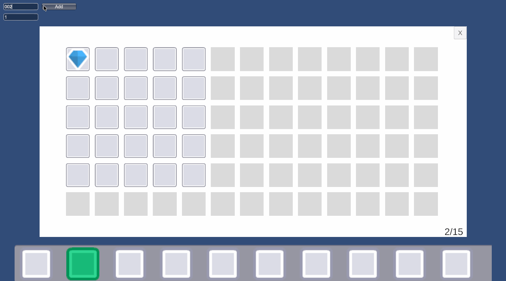
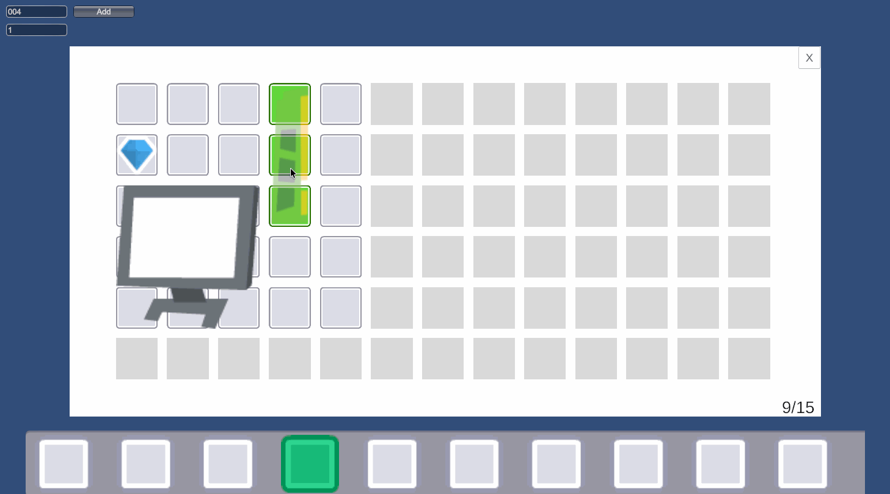
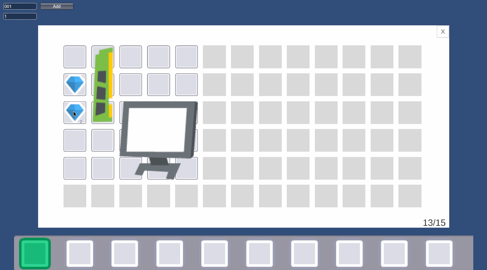
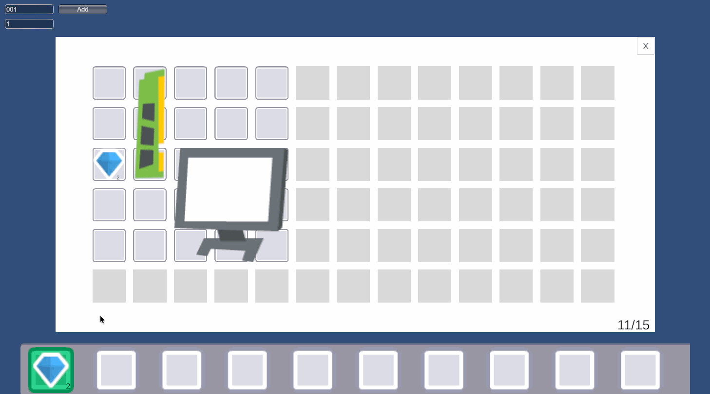

# Unity Inventory System

A modular Unity inventory system with a playable sample scene.

Chinese Version: [README.zh-CN.md](README.zh-CN.md)

## Demo

### Backpack Basics

Shows opening the backpack, adding items from the sample GUI, and the overall grid-based layout.



### Drag And Rotate

Shows drag movement, placement preview, and item rotation during drag.



### Split Merge Drop

Shows right-drag split interaction, stack merging, and dropping items outside the backpack.



### Quick Bar Flow

Shows quick bar binding and slot switching flow.



## Features

- Grid-based backpack with multi-size item placement
- Item rotation
- Stackable items
- Unlockable backpack cells
- Quick bar binding and selection
- Mouse wheel quick bar switching
- Basic weight calculation with UI feedback
- Data-driven setup through `ScriptableObject`
- Runtime access split into focused interfaces for UI and external systems
- Sample scene wired with Unity Input System

## What's Implemented

### Runtime

- `InventoryGrid` handles placement checks, overlap detection, auto placement, moving, stacking, merging, and splitting
- `PlayerInventory` wraps backpack data, quick bar state, weight, and player-facing operations
- `InventoryManager` acts as the default runtime facade and exposes multiple focused interfaces
- `InventoryEventCentre` handles inventory and quick bar related events
- `InventorySystemBootstrap` creates the runtime manager and registers static service entry points

### Runtime Interfaces

- `IInventoryRuntime` for general inventory access
- `IInventoryEventSource` for event registration and dispatch
- `IBackpackReadOnly` for read-only backpack state
- `IQuickBarReadOnly` for read-only quick bar state
- `IBackpackViewRuntime` for backpack UI placement and binding logic
- `IBackpackCommandRuntime` for advanced commands such as drop, split, and merge

### UI

- Backpack panel
- Quick bar panel
- Left-drag full stack movement
- Placement preview
- Item rotation during drag
- Drag item to quick bar slot to bind
- Drag item outside the backpack to drop it
- Drag onto a compatible stack to merge
- Right-drag half a stack as a split interaction

### Sample

- Demo scene: `Assets/Scenes/SampleScene.unity`
- Sample input wrapper: `Assets/Scripts/Sample/SampleInventoryInput.cs`
- Input action asset: `Assets/SampleInventoryInputAction.inputactions`
- A simple debug GUI is available in the top-left corner for adding items by ID and count

Sample item IDs:

- `001` BlueGem
- `002` Health
- `003` Monitor
- `004` RAM

## Getting Started

### Environment

- Unity `6000.3.9f1`
- URP
- Input System

### Run the Sample

1. Open the project in Unity.
2. Open `Assets/Scenes/SampleScene.unity`.
3. Enter Play Mode.
4. Use the debug GUI in the top-left corner to add items by ID and count.

### Default Controls

- `Tab`: open / close backpack
- `R`: rotate current dragged item
- `1` to `0`: select quick bar slot
- Mouse wheel: switch quick bar selection
- Left drag: move a full stack
- Right drag: drag half of a stack
- Drag outside the backpack: drop items
- Drag onto a compatible stack: merge items
- Drag onto a quick bar slot: bind item to quick bar

## Interaction Notes

- Left drag moves a full stack.
- Right drag starts a half-stack split preview.
- Releasing outside the backpack drops the dragged amount.
- Releasing over a compatible stack merges the dragged amount.

## Project Structure

```text
Assets
├── ArtRes                   # Item and UI art resources
├── Configs                  # Item, backpack, quick bar, and view configs
├── Prefabs/UI               # Backpack and quick bar prefabs
├── Scenes                   # Sample scene
├── SampleInventoryInputAction.inputactions
└── Scripts
    ├── Runtime
    │   ├── Core             # System entry, bootstrap, events, interfaces, shared configs
    │   ├── Data             # ItemDefinition / ItemDatabase / ItemInstance
    │   ├── Inventory
    │   │   ├── Backpack     # Backpack data and backpack UI
    │   │   ├── Internal     # Internal grid and manager implementation
    │   │   ├── Player       # Player inventory wrapper
    │   │   └── QuickBar     # Quick bar data and UI
    │   └── UI               # Shared panel base
    └── Sample               # Sample input and scene controller scripts
```

## Design Notes

The current structure is centered around a small runtime core plus feature-specific layers:

- `ItemDefinition` stores static item data
- `ItemInstance` represents a runtime item instance
- `PlacedItem` stores item position, size, and rotation inside the grid
- `InventoryGrid` owns placement rules and low-level grid operations
- `PlayerInventory` encapsulates player-facing inventory behavior
- `InventoryManager` exposes a cleaner facade for UI and external systems
- `InventorySystemBootstrap` wires everything together for scene usage

The UI layer is intentionally kept dependent on focused runtime interfaces instead of directly depending on all runtime implementation details.

## UML Class Diagram


## Roadmap

- Item instance factory or spawn service
- Save / load support
- More specific event types
- Additional gameplay-facing item actions built on top of the current runtime API
